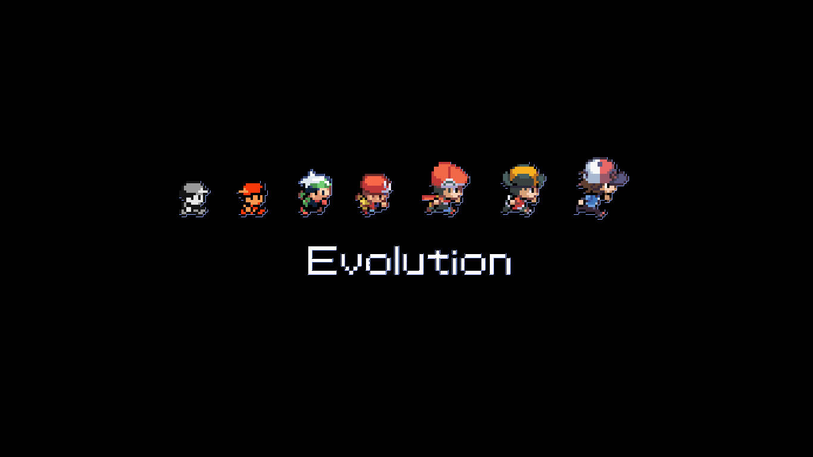
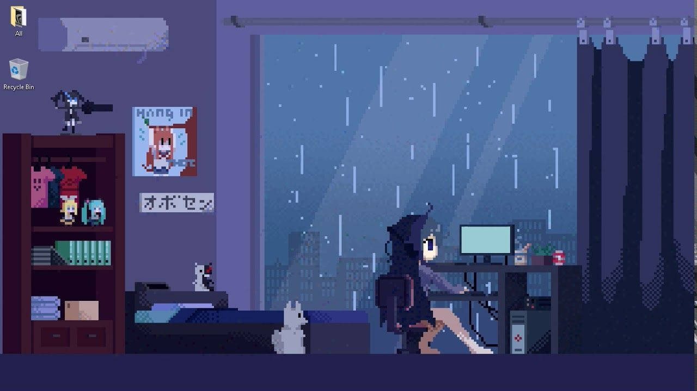
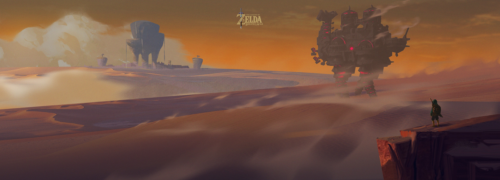
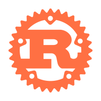
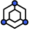
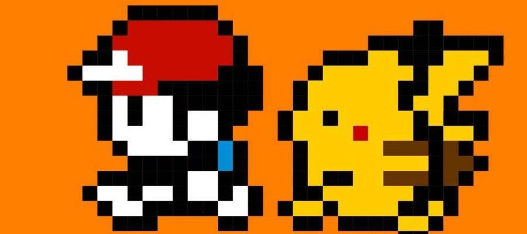

<!--
**ash-z01/ash-z01** is a ✨ _special_ ✨ repository because its `README.md` (this file) appears on your GitHub profile.
-->

<!--  -->

<!--  -->
<!--  -->

### 👨🏻‍💻 &nbsp;About Me

* 💡 &nbsp; I like to explore new technologies, think about interesting or whimsical questions.

* 🌱 &nbsp; I'm constantly learning about Computer Science, Mathematics, Painting, and making a better cup of coffee.

* ✉️ &nbsp;You can shoot me an email at `ash-z@foxmail.com` . I'll try to respond as soon as I can.

### 🎨 &nbsp; Mixed~
<!-- ### 🛠😜 &nbsp; I use it~ -->

<code></code>
&nbsp;
<code></code>
&nbsp;
<code></code>
&nbsp;
<code></code>
&nbsp;
<code></code>
&nbsp;
<code></code>
&nbsp;
<code></code>
&nbsp;
<code></code>
&nbsp;
<code></code>
&nbsp;
<code></code>
&nbsp;
<code></code>
&nbsp;
<code></code>
&nbsp;
<code></code>
&nbsp;
<code></code>
&nbsp;
<code></code>
&nbsp;
<code></code>
&nbsp;
<code></code>
&nbsp;
<code></code>
&nbsp;
<code></code>
&nbsp;
<code></code>
&nbsp;

### 🍻 &nbsp; Social

<code></code>
&nbsp;
<code></code>
&nbsp;
<code></code>
&nbsp;
<code></code>
&nbsp;
<code></code>
&nbsp;
<code></code>
&nbsp;
<code></code>

<!-- ### ⚙️ &nbsp; GitHub Analytics

    

 -->

### 🤝🏻 &nbsp;Connect

<em>
    <b>I like to meet interesting friends.</b>
    <b>so if you want to say hello, </b>
    <b>I'll be happy to see you again.</b> 😊
</em>

---
⭐️ From [XYZ](https://github.com/ash-z01)  
