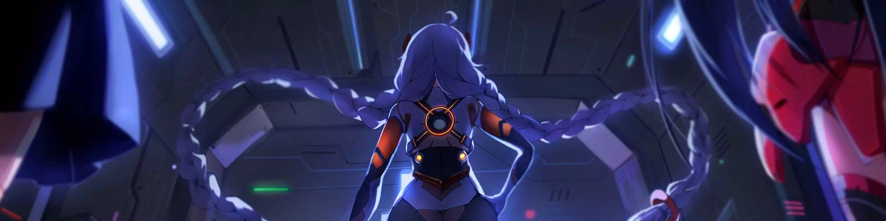
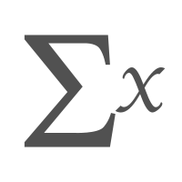

### Hi 👋~~    Welcome to [Rubik Cell Space](https://ash-z01.github.io) !! 🚀

<!--
**ash-z01/ash-z01** is a ✨ _special_ ✨ repository because its `README.md` (this file) appears on your GitHub profile.

Here are some ideas to get you started:

- 🔭 I’m currently working on ...
- 🌱 I’m currently learning ...
- 👯 I’m looking to collaborate on ...
- 🤔 I’m looking for help with ...
- 💬 Ask me about ...
- 📫 How to reach me: ...
- 😄 Pronouns: ...
- ⚡ Fun fact: ...
-->

---------------------------------------------------------

<!-- 
 
 

-->

<!--  -->

### 👨🏻‍💻 &nbsp;About Me

<!--
-  **Explore** Development :zap: | Open-Source :fire:    
-  **Hobbies** History 📖 & Math 📚 & Coffee ☕ & Complexity 🏹 & Painting 🖌️
-  **Contact** [Rubik](ash-z01@qq.com)
-->

* 💡 &nbsp; I like to explore new technologies, think about interesting or whimsical questions.

* 🌱 &nbsp; I'm constantly learning about Computer Science, Mathematics, Complexity Science, Painting, and making a better cup of coffee.

* ✉️ &nbsp;You can shoot me an email at ash-z01@qq.com . I'll try to respond as soon as I can.

### 🎨 &nbsp; Mixed~
<!-- ### 🛠😜 &nbsp; I use it~ -->

### 🍻 &nbsp; Social

### ⚙️ &nbsp; GitHub Analytics

    
<!--  -->

### 🤝🏻 &nbsp;Connect with Me

<em>
    <b>I like to meet interesting friends.</b>
    <b>so if you want to say hello, </b>
    <b>I'll be happy to see you again.</b> 😊
</em>

---
⭐️ From [Rubik](https://github.com/ash-z01)
