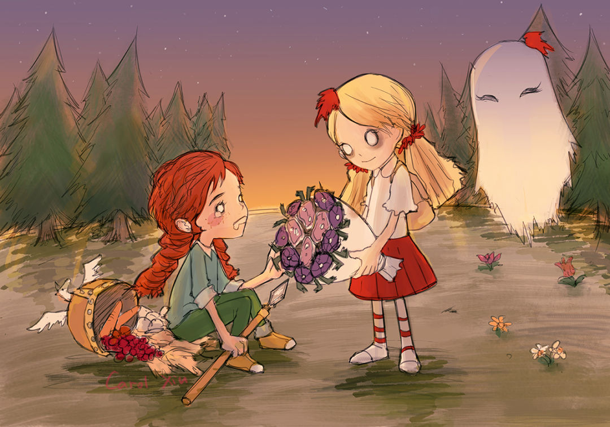

<!--
**YY-Meow/YY-Meow** is a ✨ _special_ ✨ repository because its `README.md` (this file) appears on your GitHub profile. 🌱
-->

<!--  -->

<!--  -->

## 🍻 &nbsp;Cheers~

<em>

<b> 💡 &nbsp; I’m a magician disguised as an engineer. Like to explore new technologies, think about interesting or whimsical questions.</b>

<b> ✨ &nbsp; I'm constantly refining magic in Computer Science, Mathematics, and Coffee.</b>

<b> 🌀 &nbsp; I'm also a Pokémon Trainer. Chance a Pokémon battle!!~</b>

<b> 🚀 &nbsp; Finally, I'm interested in Oxygen-Not-Included and Celeste. I recommend you try it out~</b>

</em>

## 👻 &nbsp; Mix~
<!-- ### 🛠😜 &nbsp; I use it~ -->

<code></code>
&nbsp;
<code></code>
&nbsp;
<code></code>
&nbsp;
<code></code>
&nbsp;
<code></code>
&nbsp;
<code></code>
&nbsp;
<code></code>
&nbsp;
<code></code>
&nbsp;
<code></code>
&nbsp;
<code></code>
&nbsp;
<code></code>
&nbsp;
<code></code>
&nbsp;

<!-- ## ⚙️ &nbsp; GitHub Analytics

    

 -->

<!-- ## 🤝🏻 &nbsp;Connect

 -->

<em>
    <b>You can find how to contact me in the sidebar. </b>
    <b>Let’s find out more interesting things together!</b> 😊
</em>

---
⭐️ From [YY-Meow](https://github.com/YY-Meow)  
